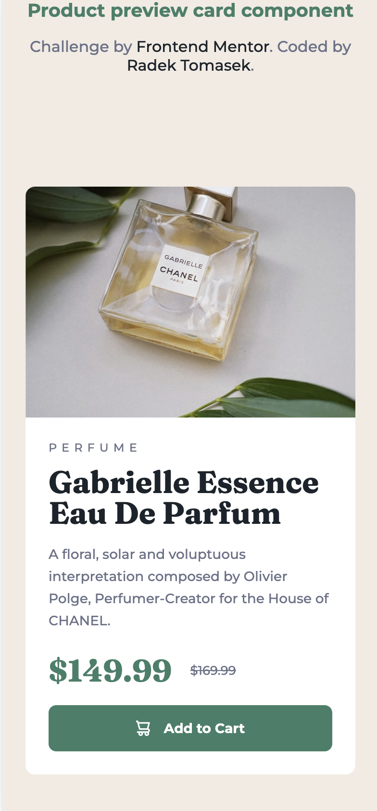
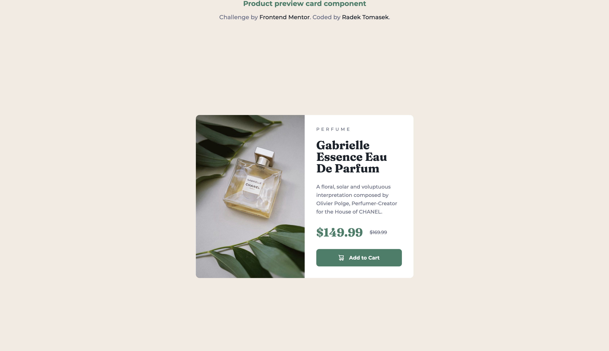

# Product Preview Card Component

This repository contains an implementation of one of the Frontend Mentor Challenges - [Product preview card component](https://www.frontendmentor.io/challenges/product-preview-card-component-GO7UmttRfa) using HTML/CSS.

## Overview

### The Challenge

[This challenge](https://www.frontendmentor.io/challenges/product-preview-card-component-GO7UmttRfa) was the tenth one I picked from the [Frontend Mentor](https://www.frontendmentor.io).

The challenge was not complicated and in fact, it was very similar to the other card related one. However, I've picked it up for two reasons - In the first place, I felt it was a good test for utilizing the [new developer mode in Figma](https://www.figma.com/dev-mode) and I also just would like to solve most of the challenges in general.

Let's breakup the solution in the next few sections.

### Screenshots

There are a few screenshots captured within the various screen sizes.

#### Mobile Version

This is the **mobile version** as displayed on **iPhone 12 Pro**.

#### Desktop Version

This is the **desktop version** as displayed on a large screen.

### Links

- Solution URL: [https://github.com/radektomasek/fm-product-preview-card-component](https://github.com/radektomasek/fm-product-preview-card-component)
- Live Site URL: [https://radektomasek.github.io/product-preview-card-component](https://radektomasek.github.io/product-preview-card-component)

## My process

I picked up this implementation as a quick test of the [new developer mode in Figma](https://www.figma.com/dev-mode) and it went quite smoothly. 

**Here are a few hightlights from my implementation**

I experimented a bit with responsive images, but realized this challenge might not be the best use-case for them and defaulted the solution to the standard background images. 

Based on some feedback I received in my previous challenge, **I put an empty description to the svg** as the one used in this project is just for decorative purpose.

### Built with

- Semantic HTML5 markup
- Mobile-first workflow
- CSS Flexbox
- CSS Custom Properties (variables)
- [Parcel](https://parceljs.org) - a simple, zero config builder

### What I learned

Whilst using `flex-basis`, I realized that things are slightly complicated when the elements are **justified or aligned** in non-started positions.

Another thing, related to [developer mode in Figma](https://www.figma.com/dev-mode) was that `line-height` is generated with unit (`rem`), which in that case is not optimal as there needs to be a ratio for better scalability.

### Continued development

It's fun doing these [Frontend mentor challenges](https://www.frontendmentor.io/challenges) in my spare time. Last few weeks were a bit busy as I had been travelling a bit, but I am happy to keep going and try to solve as many of them as possible.

## Author

- Frontend Mentor - [@radektomasek](https://www.frontendmentor.io/profile/radektomasek)
- Linkedin - [radektomasek](https://www.linkedin.com/in/radektomasek)
- Twitter - [@radek_tomasek](https://twitter.com/radek_tomasek)
